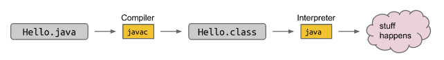

# 1.1 Essentials

## Hello World

**code**: _01HelloWorld.java

Let's look at our first Java program. When run, the program below prints "Hello world!" to the screen. 

```java
public class HelloWorld {
	public static void main(String[] args) {
    	System.out.println("Hello World");
	}
}
```

For those of you coming from a language like Python, this probably seems needlessly verbose. However, it's all for good reason, which we'll come to understand over the next couple of weeks. Some key syntactic  features to notice:

- The program consists of a **class declaration,** which is declared using the keywords `public class`. In Java, **all code lives inside of classes**.
- **The code that is run is inside** of a method called `main`, which is declared as `public static void main(String[] args)`. Eventually functions will be called from here.
- We use **curly braces** `{` and `}` to denote the beginning and the end of a section of code.
- Statements **must end** with semi-colons.

## Running a Java Program

The most common way to execute a Java program is to run it through a  sequence of two programs. 

- The first is the Java compiler, or `javac`. 
- The second is the Java interpreter, or `java`.



For example, to run `HelloWorld.java`, we'd type the command `javac HelloWorld.java` into the terminal, followed by the command `java HelloWorld`. The result would look something like this:

```shell
$ javac HelloWorld.java #compiled the java file and turned it into a .class file
$ java HelloWorld #runs the .class file, no need to put .class file extension
Hello World! 
```

You may notice that we include the '.java' when compiling, but we don't  include the '.class' when interpreting. This is just the way it is  (TIJTWII).

Why make a class file at all?

- .class file has been type checked. Distributed code is safer.
- .class files are 'simpler' for machines to execute. Distributed code is faster.

- Minor benefit: Protects your intellectual property. No need to give out source. (there are tools that can decompile .class files )

Note: JDK is for developing java programs and JRE is for running. Usually the JDK contains JRE and the JVM, while the JRE only contains the JVM.

## Variables and Loops

**code**: _02HelloNumbers.java

```java
public class HelloNumbers {
    public static void main(String[] args) {
        int x = 0;
        while (x < 10) {
            System.out.print(x + " ");
            x = x + 1;
        }
    }
}
```

```shell
$ javac HelloNumbers.java
$ java HelloNumbers
$ 0 1 2 3 4 5 6 7 8 9 
```

Some interesting features of this program that might jump out at you:

- Our variable x must be declared before it is used, *and it must be given a type!*
- Our loop definition is contained inside of curly braces, and the  boolean expression that is tested is contained inside of parentheses.
- Our print statement is just `System.out.print` instead of `System.out.println`. This means we should not include a newline (a return).
- Our print statement adds a number to a space. This makes sure the  numbers don't run into each other. Try removing the space to see what  happens. 
- When we run it, our prompt ends up on the same line as the numbers (which you can fix in the following exercise if you'd like).

Of these features the most important one is the fact that variables have a **declared type.** 

## Static Typing

One of the most important features of Java is that all variables and expressions have a so-called `static type`. Java variables can contain values of that type, and only that type. **Furthermore, the type of a variable can never change.**

One of the key features of the Java compiler is that it performs a  static type check. For example, suppose we have the program below

```java
public class HelloNumbers {
    public static void main(String[] args) {
        int x = 0;
        while (x < 10) {
            System.out.print(x + " ");
            x = x + 1;
        }
        x = "horse";
    }
}
```

```
$ javac HelloNumbers.java 
HelloNumbers.java:9: error: incompatible types: String cannot be converted to int
        x = "horse";
                ^
1 error
```

The compiler rejects this program out of hand before it even runs.  This is a big deal, because it means that **there's no chance that  somebody running this program out in the world will ever run into a type error!**

This is in contrast to dynamically typed languages like Python, where users can run into type errors during execution!

In addition to providing additional error checking, static types also let the programmer know exactly what sort of object he or she is  working with. We'll see just how important this is in the coming weeks.  This is one of my personal favorite Java features.

To summarize, static typing has the following advantages:

- The compiler ensures that all types are compatible, making it easier for the programmer to debug their code.
- Since the code is guaranteed to be free of type errors, users of  your compiled programs will never run into type errors. **For example,  Android apps are written in Java, and are typically distributed only as  .class files, i.e. in a compiled format. As a result, such applications  should never crash due to a type error since they have already been  checked by the compiler.**
- Every variable, parameter, and function has a declared type, making  it easier for a programmer to understand and reason about code.

However, we'll see that static typing comes with disadvantages, to be discussed in a later chapter.

Consider these two Java statements:

```java
String h = 5 + "horse";
```

and

```java
int h = 5 + "horse";
```

The first one of these will succeed; the second will give a compiler error.  Since Java is strongly typed, if you tell it `h` is a string, it can concatenate the elements and give you a string.  But when `h` is an `int`, it can't concatenate a number and a string and give you a number.  

## Defining Functions in Java

In languages like Python, functions can be declared anywhere, even  outside of functions. For example, the code below declares a function  that returns the larger of two arguments, and then uses this function to compute and print the larger of the numbers 8 and 10:

```python
def larger(x, y):
    if x > y:
        return x
    return y

print(larger(8, 10))
```

Since all Java code is part of a class, we must define functions so that they belong to some class. Functions that are part of a class are  commonly called "methods". We will use the terms interchangeably  throughout the course. The equivalent Java program to the code above is  as follows:

```java
public class LargerDemo {
    public static int larger(int x, int y) {
        if (x > y) {
            return x;
        }
        return y;
    }

    public static void main(String[] args) {
        System.out.println(larger(8, 10));
    }
}
```

## Code Style, Comments, Javadoc

- Consistent style (spacing, variable naming, brace style, etc)

- Size (lines that are not too wide, source files that are not too long)

- Descriptive naming (variables, functions, classes), e.g. variables or functions with names like `year` or `getUserName` instead of `x` or `f`.

- Avoidance of repetitive code: You should almost never have two  significant blocks of code that are nearly identical except for a few  changes.

- Comments where appropriate. Line comments in Java use the `//` delimiter. Block (a.k.a. multi-line comments) comments use  `/*` and `*/`.

- Always have comments above functions, with the JavaDoc style

  ```java
  /** Returns the larger of x and y
  	@precondition*/	   
  public static int larger(int x, int y) {
          if (x > y) {
              return x;
          }
          return y;
  }
  ```

  

The golden rule is this: Write your code so that it is easy for a stranger or **yourself in the future** to understand.


# 1.2 Objects

## Defining and Using Classes

### Static vs. Non-Static Methods

code: _04Dog.java

#### Static Methods

All code in Java must be part of a class (or something similar to a  class, which we'll learn about later). Most code is written inside of  methods. Let's consider an example:

```java
public class Dog {
    public static void makeNoise() {
        System.out.println("Bark!");
    }
}
```

If we try running the `Dog` class, we'll simply get an error message:

```
$ java Dog
Error: Main method not found in class Dog, please define the main method as:
       public static void main(String[] args)
```

The `Dog` class we've defined doesn't do anything. We've simply defined something that `Dog` **can** do, namely make noise. To actually run the class, we'd either need to add a main method to the `Dog` class, as we saw in chapter 1.1. Or we could create a separate `DogLauncher` class that runs methods from the `Dog` class. For example, consider the program below:

```java
public class DogLauncher {
    public static void main(String[] args) {
        Dog.makeNoise();
    }
}
$ java DogLauncher
Bark!
```

A class that uses another class is sometimes called a "client" of that class, i.e. `DogLauncher` is a client of `Dog`. Neither of the two techniques is better: Adding a main method to `Dog` may be better in some situations, and creating a client class like `DogLauncher` may be better in others. The relative advantages of each approach will  become clear as we gain additional practice throughout the course.

#### Instance Variables and Object Instantiation

Not all dogs are alike. Some dogs like to yap incessantly, while  others bellow sonorously, bringing joy to all who hear their glorious  call. Often, we write programs to mimic features of the universe we  inhabit, and Java's syntax was crafted to easily allow such mimicry.

One approach to allowing us to represent the spectrum of Dogdom would be to create separate classes for each type of Dog.

```java
public class TinyDog {
    public static void makeNoise() {
        System.out.println("yip yip yip yip");
    }
}

public class MalamuteDog {
    public static void makeNoise() {
        System.out.println("arooooooooooooooo!");
    }
}
```

As you should have seen in the past, classes can be instantiated, and **instances can hold data**. This leads to a more natural approach, where  we create instances of the `Dog` class and make the behavior of the `Dog` methods contingent upon the properties of the specific `Dog`. To make this more concrete, consider the class below:

```java
public class Dog {
    public int weightInPounds;

    public void makeNoise() {
        if (weightInPounds < 10) {
            System.out.println("yipyipyip!");
        } else if (weightInPounds < 30) {
            System.out.println("bark. bark.");
        } else {
            System.out.println("woof!");
        }
    }    
}
```

As an example of using such a Dog, consider:

```java
public class DogLauncher {
    public static void main(String[] args) {
        Dog d;
        d = new Dog();
        d.weightInPounds = 20;
        d.makeNoise();
    }
}
```

When run, this program will create a `Dog` with weight 20, and that `Dog` will soon let out a nice "bark. bark.". 

Some key observations and terminology:

- An `Object` in Java is an instance of any class.
- The `Dog` class has its own variables, also known as *instance variables* or *non-static variables*. These must be declared inside the class, unlike languages like Python or Matlab, where new variables can be added at runtime.
- The method that we created in the `Dog` class did not have the `static` keyword. We call such methods *instance methods* or *non-static methods*.
- To call the `makeNoise` method, we had to first *instantiate* a `Dog` using the `new` keyword, and then make a specific `Dog` bark. In other words, we called `d.makeNoise()` instead of `Dog.makeNoise()`.
- Once an object has been instantiated, it can be *assigned* to a *declared* variable of the appropriate type, e.g. `d = new Dog();`
- Variables and methods of a class are also called *members* of a class.
- Members of a class are accessed using *dot notation*.

#### Constructors in Java

As you've hopefully seen before, we usually construct objects in object oriented languages using a *constructor*:

```java
public class DogLauncher {
    public static void main(String[] args) {
        Dog d = new Dog(20);
        d.makeNoise();
    }
}
```

Here, the instantiation is parameterized, saving us the time and  messiness of manually typing out potentially many instance variable  assignments. To enable such syntax, we need only add a "constructor" to  our Dog class, as shown below:

```java
public class Dog {
    public int weightInPounds;

    public Dog(int w) {
        weightInPounds = w;
    }

    public void makeNoise() {
        if (weightInPounds < 10) {
            System.out.println("yipyipyip!");
        } else if (weightInPounds < 30) {
            System.out.println("bark. bark.");
        } else {
            System.out.println("woof!");
        }    
    }
}
```

The constructor with signature `public Dog(int w)` will be invoked anytime that we try to create a `Dog` using the `new` keyword and a single integer parameter. For those of you coming from Python, the constructor is very similar to the `__init__` method.

#### Array Instantiation, Arrays of Objects

As we saw in HW0, arrays are also instantiated in Java using the new keyword. For example:

```java
public class ArrayDemo {
    public static void main(String[] args) {
        /* Create an array of five integers. */
        int[] someArray = new int[5];
        someArray[0] = 3;
        someArray[1] = 4;
    }
}
```

Similarly, we can create arrays of instantiated objects in Java, e.g.

```java
public class DogArrayDemo {
    public static void main(String[] args) {
        /* Create an array of two dogs. */
        Dog[] dogs = new Dog[2];
        dogs[0] = new Dog(8);
        dogs[1] = new Dog(20);

        /* Yipping will result, since dogs[0] has weight 8. */
        dogs[0].makeNoise();
    }
}
```

Observe that new is used in two different ways: Once to create an array that can hold two `Dog` objects, and twice to create each actual `Dog`.

### Class Methods vs. Instance Methods

Java allows us to define two types of methods: 

- Class methods, a.k.a. static methods.
- Instance methods, a.k.a. non-static methods. 

Instance methods are actions that can be taken only by a specific  instance of a class. Static methods are actions that are taken by the  class itself. Both are useful in different circumstances. As an example  of a static method, the `Math` class provides a `sqrt` method. Because it is static, we can call it as follows:

```java
x = Math.sqrt(100);
```

If `sqrt` had been an instance method, we would have instead the awkward syntax below. Luckily `sqrt` is a static method so we don't have to do this in real programs.

```java
Math m = new Math();
x = m.sqrt(100);
```

Sometimes, it makes sense to have a class with both instance and  static methods. For example, suppose want the ability to compare two  dogs. One way to do this is to add a static method for comparing Dogs.

```java
public static Dog maxDog(Dog d1, Dog d2) {
    if (d1.weightInPounds > d2.weightInPounds) {
        return d1;
    }
    return d2;
}
```

This method could be invoked by, for example:

```java
Dog d = new Dog(15);
Dog d2 = new Dog(100);
Dog.maxDog(d, d2);
```

Observe that we've invoked using the class name, since this method is a static method. 

We could also have implemented `maxDog` as a non-static method, e.g. 

```java
public Dog maxDog(Dog d2) {
    if (this.weightInPounds > d2.weightInPounds) {
        return this;
    }
    return d2;
}
```

Above, we use the keyword `this` to refer to the current object. This method could be invoked, for example, with:

```java
Dog d = new Dog(15);
Dog d2 = new Dog(100);
d.maxDog(d2);
```

Here, we invoke the method using a specific instance variable.

**Exercise 1.2.1**: What would the following method do? If you're not sure, try it out. 

```java
public static Dog maxDog(Dog d1, Dog d2) {
    if (weightInPounds > d2.weightInPounds) {
        return this;
    }
    return d2;
}
```

#### Static Variables

It is occasionally useful for classes to have static variables. These are properties **inherent to the class itself, rather than the instance.**  For example, we might record that the scientific name (or binomen) for  Dogs is "Canis familiaris":

```java
public class Dog {
    public int weightInPounds;
    public static String binomen = "Canis familiaris";
    ...
}
```

Static variables should be accessed using the name of the class rather than a specific instance, e.g. you should use `Dog.binomen`, not `d.binomen`. 

While Java technically allows you to access a static variable using  an instance name, it is bad style, confusing, and in my opinion an error by the Java designers.

### public static void main(String[] args)

With what we've learned so far, it's time to demystify the  declaration we've been using for the main method. Breaking it into  pieces, we have:

- `public`: So far, all of our methods start with this keyword.
- `static`: It is a static method, not associated with any particular instance.
- `void`: It has no return type.
- `main`: This is the name of the method.
- `String[] args`: This is a parameter that is passed to the main method.

#### Command Line Arguments

Since main is called by the Java interpreter itself rather than  another Java class, it is the interpreter's job to supply these  arguments. They refer usually to the command line arguments. For  example, consider the program `ArgsDemo` below:

```java
public class ArgsDemo {
    public static void main(String[] args) {
        System.out.println(args[0]);
    }
}
```

This program prints out the 0th command line argument, e.g.

```
$ java ArgsDemo these are command line arguments
these
```

In the example above, `args` will be an array of Strings, where the entries are {"these", "are", "command", "line", "arguments"}.

