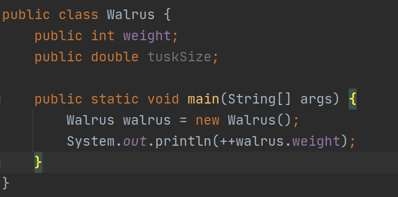
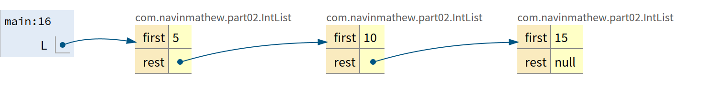

# 2.1 The Mystery of the Walrus

```java
Walrus a = new Walrus(1000, 8.3);
Walrus b;
b = a;
b.weight = 5;
System.out.println(a);
System.out.println(b);
```

 **Does the change to b affect a**? 

- **Yes**, since b is **reference type.**

```java
int x = 5;
int y;
y = x;
x = 2;
System.out.println("x is: " + x); // 2
System.out.println("y is: " + y); // 5
```

**Does the change to x affect y?**

- **No**, since x and y are **primitive type.** 

## Primitive Types

- Your computer stores information in "memory". All information in your computer is stored in *memory* as a sequence of ones and zeros. Some examples:
  - **72** is often stored as **01001000**
  - **205.75** is often stored as **01000011 01001101 11000000 00000000**
  - The letter **H** is often stored as **01001000** (same as 72)
  - The **true** value is often stored as **00000001**

- One interesting observation is that **both 72 and H are stored as 01001000**. This raises the question: **how does a piece of Java code know how to interpret 01001000**?

```java
char c = 'H';
int x = c;
System.out.println(c);
System.out.println(x);
```

### 8 primitive types

- byte (8)
- short  (16)
- int (32)
- long (64)
- float (32)
- double (62)
- boolean (1 or 8)
- char (32)

### Primitive Variable Declaration

When you declare a variable of a certain type, Java finds a **contiguous block** with exactly enough bits to hold a thing of that type. 

For  example, if you declare 

- an **int x**, you get a block of **32 bits.** 
- and for  **double y,** you get a block of **64 bits.**


**The Java language provides no way for you to know the location of the box.**

Java does not write anything into the reserved box when a variable is  declared. 

In other words, there are **no default values**. As a result, the  Java compiler prevents you from using a variable until after the box has been filled with bits using the `=` operator. Note: **This only applies for local variables** and **not instance variables** (look below)

```java
x = -1431195969;
y = 567213.112;
```


### Box notation


### The Golden Rule of Equals (GRoE)

- When you write `y = x`, you are telling the **Java interpreter to copy the bits from x into y.** 
- This Golden Rule of Equals (GRoE) is the root of all truth when it comes to understanding our Walrus Mystery.

## Reference Types

There are 8 **primitive** types in Java. byte, short, int, long, float, double, boolean, char.

Everything else is a **reference Type.**

When we *instantiate* an Object using `new` (e.g. Dog, Walrus, Planet), Java first allocates a box for each **instance variable**  of the class, and fills them with a **default value**. **The example below prints a 1.**




**If values are passed in**, then the constructor will  set these new values for these instance variables overwriting the default value, when an **instance is created.**


The **new** keyword returns where this walrus object is created in memory. Object is a sequence of bits somewhere in memory.

### Reference Variable Declaration

- Java allocates exactly a box of size 64 bits, **no matter what type of object**.
- These bits can be either set to:
  - **Null** (all zeros)
  - The 64 bit "address" of a specific instance of that class (returned by new)


looking at bits, it is cumbersome, we are going to use box notation from now on.

### Box Notation


## Parameter Passing

- GRoE also applies to parameter passing.
- Copying the bits is usually called "**pass by value**". In Java, we **always** pass by value.

```java
public static void main(String[] args) {
    double x = 5.5;
    double y = 10.5;
    double avg = average(x, y);
}
public static double average(double a, double b) {
    return (a + b) / 2;
}
```

When the function is invoked, the `average` function has its **own** scope with two new boxes labeled as `a` and `b`, and the bits are simply *copied* in. This copying of bits is what we refer to when we say "pass by value".

```java
public class PassByValueFigure {
    public static void main(String[] args) {
           Walrus walrus = new Walrus(3500, 10.5);
           int x = 9;
			//what happens here.
           doStuff(walrus, x);
           System.out.println(walrus);
           System.out.println(x);
    }

    public static void doStuff(Walrus W, int x) {
           W.weight = W.weight - 100;
           x = x - 5;
    }
}z
```

Main x doesn't change but walrus weight changes by 100 lbs.

## Instantiation of Arrays

**Array are also Objects**. As we've seen, objects are usually instantiated using the **new** keyword.

```java
int[] x = new int[]{0, 1, 2, 95, 4};
```

This is declaration and assignment in the same line. 

## IntLists

```java
public class IntList {
    public int first;
    public IntList rest;

    public IntList(int f, IntList r) {
        first = f;
        rest = r;
    }

    public static void main(String[] args) {
        IntList L = new IntList(15, null);
        L  = new IntList(10, L);
        L = new IntList(5, L);
    } 
}
```



Look at code for full implementation. 

# 2.2 The SLList