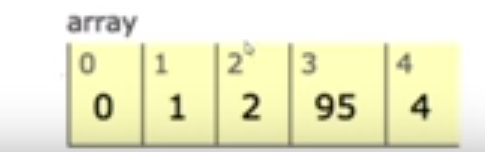
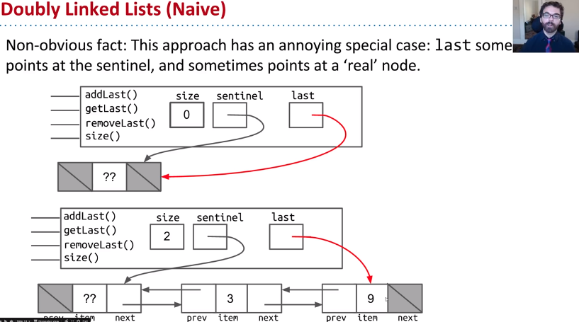

#  2.1 The Mystery of the Walrus

```java
public class Walrus {
    private int weight;
    private double tuskSize;

    public Walrus(int weight, double tuskSize) {
        this.weight = weight;
        this.tuskSize = tuskSize;
    }

    @Override
    public String toString() {
        return "Walrus{" +
                "weight=" + weight +
                ", tuskSize=" + tuskSize +
                '}';
    }

    public static void main(String[] args) {
        Walrus a = new Walrus(1000, 8.3);
        Walrus b;
        b = a;
        b.weight = 5;
        System.out.println(a); 
        System.out.println(b);
    }
}

```

```
Walrus{weight=5, tuskSize=8.3}
Walrus{weight=5, tuskSize=8.3}
```

 **Does the change to b affect a**? 

- **Yes**, since b is **reference type.**

```java
int x = 5;
int y;
y = x;
x = 2;
System.out.println("x is: " + x); 
System.out.println("y is: " + y); 
```

```
x is: 2
y is: 5
```

**Does the change to x affect y?**

- **No**, since x and y are **primitive type.** 

## How memory in computers work.

### Bits

Your computer stores information in "memory". 

- All information in your computer is stored in *memory* as a **sequence** of **ones** and **zeros**. Some examples:
  - **72** is often stored as **01001000**
  - **205.75** is often stored as **01000011 01001101 11000000 00000000**
  - The letter **H** is often stored as **01001000** (same as the number 72)
  - The **true** value is often stored as **00000001**
- One interesting observation is that **both 72 and H are stored as 01001000**. This raises the question: **how does a piece of Java code know how to interpret 01001000**?
  - Each Java type has a different way to interpret bits:
    - 8 primitive types in Java: byte, short, int, float, double, boolean, char

```java
char c = 'H';
int x = c;
System.out.println(c);
System.out.println(x);
```

```bash
H
72
```

## Primitive Types

### 8 primitive types

- byte (8 bits)
- short  (16)
- int (32)
- long (64)
- float (32)
- double (62)
- boolean (1 or 8 depending on the implementation)
- char (32)

### Primitive Variable Declaration

When you declare a variable of a certain type, Java finds a **contiguous block** with exactly enough bits to hold a thing of that type. 

For  example, if you declare 

- an **int x**, you get a block of **32 bits.** 
- and for  **double y,** you get a block of **64 bits.**


**The Java language provides no way for you to know the location of the box.**

Java does not write anything into the reserved box when a variable is  declared. 

In other words, there are **no default values**. As a result, the  Java compiler **prevents you from using a variable until after the box has been filled with bits using the `=` operator.** Note: **This only applies for local variables** and **not instance variables** (look below)

```java
int x; //declaration
double y;
x = -1431195969; //assignment
y = 567213.112;
```


### Box notation


Used in this course and for practical purposes, since full representation is cumbersome.

### The Golden Rule of Equals (GRoE)

- Given variables b and a:
  - b = a **copies** all bits from a into b.

## Reference Types

There are 8 **primitive** types in Java. byte, short, int, long, float, double, boolean, char.

**Everything else is a Reference Type.**

```java
//An example of a reference type
public class Walrus {
    private int weight;
    private double tuskSize;

    public Walrus(int weight, double tuskSize) {
        this.weight = weight;
        this.tuskSize = tuskSize;
    }
}
```

### Reference Variable Instantiation

When we *instantiate* an Object using `new` (e.g. Dog, Walrus, Planet), Java first allocates a box for each **instance variable**  of the class, and fills them with a **default value**. 

**If values are passed in**, then the constructor will  set these new values for these instance variables overwriting the default value (initially at 0), when an **instance is created.**


The **new** keyword goes out in memory and **find a massive chunk of memory** for our object but also **returns where this walrus object** is created in memory. **Object is a sequence of bits somewhere in memory.**

### Reference Variable Declaration

- Java allocates exactly a box of size 64 bits, **no matter what type of object**.
- These bits can be either set to:
  - **Null** (all zeros)
  - The 64 bit "**address**" of a specific instance of that class (returned by new)


looking at bits, it is cumbersome, we are going to use box notation from now on.

### Box Notation


## Parameter Passing

- **GRoE** also applies to parameter passing.
- Copying the bits is usually called "**pass by value**". In Java, we **always** pass by value.
- With primitive types the bits are copied, **original variable is not affected**, with reference types you copy the bits that represent the identity of the object("where the object resides in memory"), the **original object's state is changed if acted upon.**

```java
public static void main(String[] args) {
    double x = 5.5;
    double y = 10.5;
    double avg = average(x, y);
}
public static double average(double a, double b) {
    return (a + b) / 2;
}
```

When the function is invoked, the `average` function has its **own** scope with two new boxes labeled as `a` and `b`, and the bits are simply *copied* in. This copying of bits is what we refer to when we say "pass by value".

```java
public class PassByValueFigure {
    public static void main(String[] args) {
           Walrus walrus = new Walrus(3500, 10.5);
           int x = 9;
			//what happens here.
           doStuff(walrus, x);
           System.out.println(walrus);
           System.out.println(x);
    }

    public static void doStuff(Walrus W, int x) {
           W.weight = W.weight - 100;
           x = x - 5;
    }
}
```

Main x doesn't change but walrus weight changes by 100 lbs.

## Instantiation of Arrays

**Array are also Objects**. As we've seen, objects are usually instantiated using the **new** keyword.

- This is declaration and assignment in the same line.

```java
int[] x = new int[]{0, 1, 2, 95, 4};
```




Instantiates a new object which contains  5 boxes each of size 32 (int). As in previously an array is not 5 * 32 bits, a little bit of additional overhead not shown here.


- simplified syntax

```java
int[] x = {0, 1, 2, 95, 4};
int y[] = {7, 5,6  89}; //both of these syntax work.
```

- Declaration and instantiation in two different lines.

```java
int[] x; //Declaration, creates a box of 64 bits, which stores addresses.
x = new [] {0, 1, 2, 95, 4}; //Instantiates a new object. 
```


Note: **Instantiated** objects can be lost.

- If an object is orphaned (**not referenced by a variable**), it gets garbage collected.


## IntLists

The difference between a list an array is that, **a list can grow arbitrarily large unlike a java array, which is of a fixed size.**

Our list is only going to be used to store Integers for simplicity.

This is all we need for implementing an IntList

```java
public class IntList {
    public int first;
    public IntList rest;

    public IntList(int f, IntList r) {
        first = f;
        rest = r;
    }
}
```


```java
public class IntList {
    public int first;
    public IntList rest;

    public static void main(String[] args) {
        IntList L = new IntList();
        L.first = 5;
        L.rest = null;

        L.rest = new IntList();
        L.rest.first = 10;

        L.rest.rest = new IntList();
        L.rest.rest.first = 15;

    }
}
```


This is kind of cumbersome to deal with so lets refactor a little bit. This code goes instantiating everything in the opposite way but we eventually get the above image.

```java
public class IntList {
    public int first;
    public IntList rest;

    public IntList(int f, IntList r) {
        first = f;
        rest = r;
    }

    public static void main(String[] args) {
        IntList L = new IntList(15, null);
        L = new IntList(10, L); //We are reassigning pointers here.
        L = new IntList(5, L);
    }
}
```


### Full Implementation

```java
public class IntList {
    public int first;
    public IntList rest;

    public IntList(int f, IntList r) {
        first = f;
        rest = r;
    }

    /** Recursively get value of a certain value.  **/
    public int get(int i) {
        if(i == 0)
            return this.first;
        return this.rest.get(--i);
    }

    public int iterativeGet(int i) {
        int counter = 0;
        IntList runner = this;
        while(counter < i) {
            runner = runner.rest;
            counter++;
        }
        return runner.first;
    }

    /** Return the size of the list using... recursion!*/
    public int size() {
        if(rest == null) {
            return 1;
        }
        return 1 + this.rest.size();
    }

    public int iterativeSize() {
        int count = 0;
        IntList runner = this;
        if(runner == null)
            return count;
        while(runner != null) {
            runner = runner.rest;
            count++;
        }
        return count;
    }

    public static IntList incrList(IntList L, int x) {
        IntList Runner  = L;
        return L;
    }

    public static IntList dincrList(IntList L, int x) {
        return L;
    }
    public static void main(String[] args) {
        IntList L = new IntList(15, null);
        L = new IntList(10, L);
        L = new IntList(5, L);

        System.out.println(L.size());
        System.out.println(L.iterativeSize());
        System.out.println(L.get(1));
        System.out.println(L.iterativeGet(1));
    }
}
```


# 2.2 The SLList

## Improvement #1: Rebranding

IntList is from before is a **naked recursive** data structure.  In order to use an `IntList` correctly, the programmer must  understand and utilize recursion even for simple list related tasks.  The recursion is right there, for all to see.

This limits its usefulness to novice programmers, and 

- potentially  introduces a whole new class of tricky errors that programmers might run into, 
- depending on what sort of helper methods are provided by the `IntList` class.

First we create the IntNode class to house all the recursion.

```java
public class IntNode {
    public int item;
    public IntNode next;

    public IntNode(int i, IntNode n) {
        item = i;
        next = n;
    }
}
```


## Improvement #2: Bureaucracy

```java
public class SLList {
    public IntNode first;

    public SLList(int x) {
        first = new IntNode(x, null);
    }

    public static void main(String[] args) {
        /** Creates a list of one integer, namely 10 */
        SLList L = new SLList(10);
    }
}
```

As you can see above, we have hidden dealing with pointers and assignment trickery to make out ds work, it now clean. Let's compare the IntList vs SLList now.

```java
IntList L1 = new IntList(5, null);
SLList L2 = new SLList(5);
```


## addFirst and getFirst

We now add new functionality to out DS.

```java
public class SLList {
    public IntNode first;

    public SLList(int x) {
        first = new IntNode(x, null);
    }

    /** Adds an item to the front of the list. */
    public void addFirst(int x) {
        first = new IntNode(x, first);
    }
    
    /** Retrieves the front item from the list. */
	public int getFirst() {
    	return first.item;
	}
    
}
```

Let's compare how both IntList and SLList does the same thing again.

```java
/** Adding two values in the front of the list and fetching the first value */
IntList L = new IntList(15, null);
L = new IntList(10, L);
L = new IntList(5, L);
int x = L.first;
```

```java
/** Adding two values in the front of the list and fetching the first value */
SLList L = new SLList(15);
L.addFirst(10);
L.addFirst(5);
int x = L.getFirst();
```


The user of the IntList has pointers directly into the DS, which requires the user to understand recursion. The user of the SLList has a middle man to go through that abstracts these things out.


## Improvement #3 Public vs. Private

If I make IntNode private, then any user that would use our SLList class **wouldn't have access** to all the variables in IntNode, this is important so that the users don't do any unintended actions is not supported by  our DataStructure. 

```java
public class SLList {
    private IntNode first;

    public SLList(int x) {
        first = new IntNode(x, null);
    }
```

## Why Restrict Access?

- Hide implementation details form users of your class.

  - The user does not need to know about the first variable (IntNode), it is an implementation detail that **only we the creators of SLList** need to be bothered with. The users can think of SLList as a magic black box.
  - Safe for you to change private methods (implementation)

  Car analogy

  - **Public**: Pedals, Steering Wheel **Private**: Fuel line, Rotary valve
  - Despite the term 'access control';
    - Nothing to do with protection against hackers, spies, and other evil entities.

- If you make something **public** in java, the expectation is that then you will never change it.


## Improvement #4 Nested Classes

### Why is it Useful?

Nested Classes are useful when a class doesn't stand on its won and its obviously subordinate to another class.

- Make the nested class private if other classes should never use the nested class.

In our case, makes sense to make IntNode a nested private class.

- Hard to imagine other classes having a need to manipulate IntNodes. So if no one needs a IntNode reference make it private.

- If the IntNode class never uses any details of the SLList class, **if the nested class never needs to look out   then you can add the keyword static.** (in this case think of static as never looks outwards)

  - IntNode **cannot** use any of SLLists's constructors, methods or variables.

   gives a tiny bit of memory saving. Whenever you make a nested java class private, the access modifiers **inside the class** do not matter.

```java
public class SLList {
    private static class IntNode {
        public int item;
        public IntNode next;

        public IntNode(int i, IntNode n) {
            item = i;
            next = n;
        }
    }

    private IntNode first;
    public SLList(int x) {
        first = new IntNode(x, null);
    }

    /** Adds x to the front of the list. */
    public void addFirst(int x) {
        first = new IntNode(x, first);
    }

    /** Returns the first item in the list. */
    public int getFirst() {
        return first.item;
    }

    public static void main(String[] args) {
        /** Creates a list of one integer, namely 10 */
        SLList L = new SLList(15);
        L.addFirst(10);
        L.addFirst(5);
        System.out.println(L.getFirst());
    }
}

```

 

## addLast() and size()

```java
public class SLList {
    private static class IntNode {
        public int item;
        public IntNode next;

        public IntNode(int i, IntNode n) {
            item = i;
            next = n;
        }
    }

    private IntNode first;
    public SLList(int x) {
        first = new IntNode(x, null);
    }

    /** Adds x to the front of the list. */
    public void addFirst(int x) {
        first = new IntNode(x, first);
    }

    /** Returns the first item in the list. */
    public int getFirst() {
        return first.item;
    }

    public void addLast(int x) {
        IntNode runner = first;
        while(runner.next != null){
            runner = runner.next;
        }
        runner.next = new IntNode(x, null);
    }
    public int iterativeSize() {
        int x = 0;
        IntNode runner = first;
        while(runner.next !=null){
           runner = runner.next;
           ++x;
        }
        return ++x;
    }

    /** Returns the size of the list that starts at IntNode p.
     * The reason for this helper method is because SLList is not recursive
     * This is a very common pattern when working with recursive data structures.
     * A public method which speaks the language of mortals.
     * A private method which speaks the language of the Gods.
    */
    private static int size(IntNode p){
        if(p.next == null)
            return 1;
        return 1 + size(p.next);
    }

    /** Recursive size */
    public int size() {
        return size(first);
    }

    public static void main(String[] args) {
        /** Creates a list of one integer, namely 10 */
        SLList L = new SLList(15);
        L.addFirst(10);
        L.addFirst(5);
        L.addLast(20);
        System.out.println(L.getFirst());
        System.out.println(L.size());
    }
}
```


## Improvement#5 Caching (Fast size)

Now or SLList class has size() and addLast() methods, the problem is they are kind of slow.


**b.  2000  seconds**

Solution: Maintain a special size variable that caches the size of the list.

​	Caching: putting a aside data to speed up retrieval

There ain't no such things as a free lunch.

- But spreading the work over each add call is a net win in almost any circumstances.


```java
public class SLList {
  private static class IntNode {
    public int item;
    public IntNode next;

    public IntNode(int i, IntNode n) {
      item = i;
      next = n;
    }
  }

  private IntNode first;
  private int size;

  public SLList(int x) {
    first = new IntNode(x, null);
    size = 1;
  }

  /** Adds x to the front of the list. */
  public void addFirst(int x) {
    first = new IntNode(x, first);
    ++size;
  }

  /** Returns the first item in the list. */
  public int getFirst() {
    return first.item;
  }

  public void addLast(int x) {
    IntNode runner = first;
    while (runner.next != null) {
      runner = runner.next;
    }
    runner.next = new IntNode(x, null);
    ++size;
  }

  public int size() {
    return size;
  }

  public static void main(String[] args) {
    /** Creates a list of one integer, namely 10 */
    SLList L = new SLList(15);
    L.addFirst(10);
    L.addFirst(5);
    L.addLast(20);
    System.out.println(L.getFirst());
    System.out.println(L.size());
  }
}
```


## Improvement#6 : The Empty List

We included a new constructor for the empty List scenario and fixed a bug with addLast. But it is kinda clunky.

```java
public class SLList {
    private static class IntNode {
        public int item;
        public IntNode next;

        public IntNode(int i, IntNode n) {
            item = i;
            next = n;
        }
    }

    private IntNode first;
    private int size;

    /** Creates an empty SLList */
    public SLList() {
       size = 0;
       first = null;
    }

    public SLList(int x) {
        first = new IntNode(x, null);
        size = 1;
    }

    /** Adds x to the front of the list. */
    public void addFirst(int x) {
        first = new IntNode(x, first);
        ++size;
    }

    /** Returns the first item in the list. */
    public int getFirst() {
        return first.item;
    }

    /** we have a check for an empty list scenario. kinda ugly */
    public void addLast(int x) {
       if (first == null){
          first = new IntNode(x, null);
          return;
       }
        IntNode runner = first;
        while(runner.next != null){
            runner = runner.next;
        }
        runner.next = new IntNode(x, null);
        ++size;
    }
    public int size() {
        return size;
    }

    public static void main(String[] args) {
        /** Creates a list of one integer, namely 10 */
        SLList L = new SLList(15);
        L.addFirst(10);
        L.addFirst(5);
        L.addLast(20);
        System.out.println(L.getFirst());
        System.out.println(L.size());
    }
}

```


## Improvement #6b: Sentinel Nodes

As a human programmer, you only have so much working memory.

You want to restrict the amount of complexity in your life.

- Simple code is (usually ) good code
  - Special cases are not 'simple'

The fundamental problem:

- The empty list has a null **first**. Can't access first.next

Our fix is a bit ugly

- Requires a special case
- More complex data structures will have more special cases (gross!!)

How can we avoid special cases?

- Make all SLLists (even empty) the "same".

```java
  /** we have a check for an empty list scenario. kinda ugly */
    public void addLast(int x) {
       if (first == null){
          first = new IntNode(x, null);
          return;
       }
        IntNode runner = first;
        while(runner.next != null){
            runner = runner.next;
        }
        runner.next = new IntNode(x, null);
        ++size;
    }
```

Create a special node that is always there! Let's call it a "sentinal node".


```java
public class SLList {
    private static class IntNode {
        public int item;
        public IntNode next;

        public IntNode(int i, IntNode n) {
            item = i;
            next = n;
        }
    }

    /** The first item (if it exists) is at sentinel.next */
    private IntNode sentinel;
    private int size;

    /** Creates an empty SLList */
    public SLList() {
        sentinel = new IntNode(-1, null);
        size = 0;
    }

    public SLList(int x) {
        sentinel = new IntNode(-1, null);
        sentinel.next = new IntNode(x, null);
        size = 1;
    }

    /** Adds x to the front of the list. */
    public void addFirst(int x) {
        IntNode prevFirst = sentinel.next;
        sentinel.next = new IntNode(x, prevFirst);
        ++size;
    }

    /** Returns the first item in the list. */
    public int getFirst() {
        return sentinel.next.item;
    }

    public void addLast(int x) {
        IntNode runner = sentinel.next;
        while(runner.next != null){
            runner = runner.next;
        }
        runner.next = new IntNode(x, null);
        ++size;
    }

    public int size() {
        return size;
    }

    public static void main(String[] args) {
        /** Creates a list of one integer, namely 10 */
        SLList L = new SLList(15);
        L.addFirst(10);
        L.addFirst(5);
        L.addLast(20);
        System.out.println(L.getFirst());
        System.out.println(L.size());
    }
}

```

### Notes:

- Sentinel is never null, always point to the sentinel node, it is a dummy node that avoids special cases.


## Invariants

An invariant is a condition that is guaranteed to be true during code execution

An SLList with a sentinel node has at least the following invariants:

- The sentinel reference always points to a sentinel node.
- The first node (if it exists), is always at sentinel.next
- the size variable is always the total number of items that have been added.

Invariants makes it easier to reason about code:

- Can assume they are true to simply code( addLast doesn't need to worry about nulls)
- Must ensure that methods preserve invariants.


# 2.3 DLList

## One Downside of SLLists

Inserting at the back of an SLList is much slower than the front.


## Improvement #7: Looking Back

Caching the last pointer?

```java
package part02_lists._05DLLists;

public class DLList {

    private static class IntNode {
        public int item;
        public IntNode next;


        public IntNode(int i, IntNode n) {
            item = i;
            next = n;
        }
    }

    /** The first item (if it exists) is at sentinel.next */
    private IntNode sentinel;
    private IntNode last;
    private int size;

    /** Creates an empty SLList */
    public DLList() {
        sentinel = new IntNode(-1, null);
        size = 0;
    }

    public DLList(int x) {
        sentinel = new IntNode(-1, null);
        sentinel.next = new IntNode(x, null);
        size = 1;
    }

    /** Adds x to the front of the list. */
    public void addFirst(int x) {
        IntNode prevFirst = sentinel.next;
        sentinel.next = new IntNode(x, prevFirst);
        ++size;
    }

    /** Returns the first item in the list. */
    public int getFirst() {
        return sentinel.next.item;
    }

    public void addLast(int x) {
        last.next = new IntNode(x, null);
        last = last.next;
        ++size;
    }

    public int iterativeSize() {
        int x = 0;
        IntNode runner = sentinel.next;
        while(runner.next !=null){
            runner = runner.next;
            ++x;
        }
        return ++x;
    }

    public int size() {
        return size;
    }

    public static void main(String[] args) {
   }
}
```

Turns out if addfirst and addlast will be fast, removeLast will be slow. We need to find out which element is second to last, so

- One we can make it point to null.
- second we can make the last point to the second to last, now last node.  and inorder to find the second to last item we need to iterate and get to it.


The operations at the end of the lists are pretty fast, but the middles ones are expensive, we will talk about optimizations later.

While this works, there is one limitation.



The last node sometimes points to the sentinel and sometimes points to a **real** node. We will start running into wierd if statements in out methods.

One way to avoid this happening is to add a second sentinel.

## Improvement #8 Fancier Sentinel Node(s)


When we start adding items to the list, we start adding them between the two sentinels. This approach is fine.

But there is another approach.


```java
package part02_lists._05DLLists;

public class DLList {

    private static class IntNode {
        public int item;
        public IntNode next;
        public IntNode prev;


        public IntNode(int i, IntNode n, IntNode p) {
            item = i;
            next = n;
            prev = p;
        }
    }

    /** The first item (if it exists) is at sentinel.next */
    private IntNode sentinel;
    private int size;

    /** Creates an empty SLList */
    public DLList() {
        sentinel = new IntNode(-1, null, null);
        sentinel.next = sentinel;
        sentinel.prev = sentinel;
        size = 0;
    }

    public DLList(int x) {
        sentinel = new IntNode(-1, null, null);
        sentinel.next = new IntNode(x, sentinel, sentinel);
        sentinel.prev = sentinel.next;
        size = 1;
    }

    /** Adds x to the front of the list. */
    public void addFirst(int x) {
        IntNode prevFirst = sentinel.next;
        sentinel.next = new IntNode(x, prevFirst, sentinel);
        prevFirst.prev = sentinel.next;
        ++size;
    }

    /** Returns the first item in the list. */
    public int getFirst() {
        return sentinel.next.item;
    }

    public void addLast(int x) {
        IntNode prevLast = sentinel.prev;
        sentinel.prev = new IntNode(x, sentinel, prevLast);
        prevLast.next = sentinel.prev;
        ++size;
    }


    public int size() {
        return size;
    }

    public static void main(String[] args) {
   }
}
```


## Notes:

For now the DS Doubly Linked List can be used for usecaseses that require a lot of addition and deletion on the ends.
EX: stacks and dequeues and queues.

If you want to get items from the middle of the list, it ends up being not constant time and goes to approximately O(n) time.
