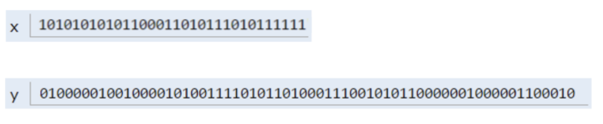

# 2.1 The Mystery of the Walrus

```java
public class Walrus {
    private int weight;
    private double tuskSize;

    public Walrus(int weight, double tuskSize) {
        this.weight = weight;
        this.tuskSize = tuskSize;
    }

    @Override
    public String toString() {
        return "Walrus{" +
                "weight=" + weight +
                ", tuskSize=" + tuskSize +
                '}';
    }

    public static void main(String[] args) {
        Walrus a = new Walrus(1000, 8.3);
        Walrus b;
        b = a;
        b.weight = 5;
        System.out.println(a); 
        System.out.println(b);
    }
}

```

```
Walrus{weight=5, tuskSize=8.3}
Walrus{weight=5, tuskSize=8.3}
```

 **Does the change to b affect a**? 

- **Yes**, since b is **reference type.**

```java
int x = 5;
int y;
y = x;
x = 2;
System.out.println("x is: " + x); 
System.out.println("y is: " + y); 
```

```
x is: 2
y is: 5
```

**Does the change to x affect y?**

- **No**, since x and y are **primitive type.** 

## How memory in computers work.

### Bits

Your computer stores information in "memory". 

- All information in your computer is stored in *memory* as a **sequence** of **ones** and **zeros**. Some examples:
  - **72** is often stored as **01001000**
  - **205.75** is often stored as **01000011 01001101 11000000 00000000**
  - The letter **H** is often stored as **01001000** (same as the number 72)
  - The **true** value is often stored as **00000001**
- One interesting observation is that **both 72 and H are stored as 01001000**. This raises the question: **how does a piece of Java code know how to interpret 01001000**?
  - Each Java type has a different way to interpret bits:
    - 8 primitive types in Java: byte, short, int, float, double, boolean, char

```java
char c = 'H';
int x = c;
System.out.println(c);
System.out.println(x);
```

```bash
H
72
```

## Primitive Types

### 8 primitive types

- byte (8 bits)
- short  (16)
- int (32)
- long (64)
- float (32)
- double (62)
- boolean (1 or 8 depending on the implementation)
- char (32)

### Primitive Variable Declaration

When you declare a variable of a certain type, Java finds a **contiguous block** with exactly enough bits to hold a thing of that type. 

For  example, if you declare 

- an **int x**, you get a block of **32 bits.** 
- and for  **double y,** you get a block of **64 bits.**


**The Java language provides no way for you to know the location of the box.**

Java does not write anything into the reserved box when a variable is  declared. 

In other words, there are **no default values**. As a result, the  Java compiler **prevents you from using a variable until after the box has been filled with bits using the `=` operator.** Note: **This only applies for local variables** and **not instance variables** (look below)

```java
int x; //declaration
double y;
x = -1431195969; //assignment
y = 567213.112;
```



### Box notation


Used in this course and for practical purposes, since full representation is cumbersome.

### The Golden Rule of Equals (GRoE)

- Given variables b and a:
  - b = a **copies** all bits from a into b.

## Reference Types

There are 8 **primitive** types in Java. byte, short, int, long, float, double, boolean, char.

**Everything else is a Reference Type.**

```java
//An example of a reference type
public class Walrus {
    private int weight;
    private double tuskSize;

    public Walrus(int weight, double tuskSize) {
        this.weight = weight;
        this.tuskSize = tuskSize;
    }
}
```

### Reference Variable Instantiation

When we *instantiate* an Object using `new` (e.g. Dog, Walrus, Planet), Java first allocates a box for each **instance variable**  of the class, and fills them with a **default value**. 

**If values are passed in**, then the constructor will  set these new values for these instance variables overwriting the default value (initially at 0), when an **instance is created.**


The **new** keyword goes out in memory and **find a massive chunk of memory** for our object but also **returns where this walrus object** is created in memory. **Object is a sequence of bits somewhere in memory.**

### Reference Variable Declaration

- Java allocates exactly a box of size 64 bits, **no matter what type of object**.
- These bits can be either set to:
  - **Null** (all zeros)
  - The 64 bit "**address**" of a specific instance of that class (returned by new)


looking at bits, it is cumbersome, we are going to use box notation from now on.

### Box Notation


## Parameter Passing

- **GRoE** also applies to parameter passing.
- Copying the bits is usually called "**pass by value**". In Java, we **always** pass by value.
- With primitive types the bits are copied, **original variable is not affected**, with reference types you copy the bits that represent the identity of the object("where the object resides in memory"), the **original object's state is changed if acted upon.**

```java
public static void main(String[] args) {
    double x = 5.5;
    double y = 10.5;
    double avg = average(x, y);
}
public static double average(double a, double b) {
    return (a + b) / 2;
}
```

When the function is invoked, the `average` function has its **own** scope with two new boxes labeled as `a` and `b`, and the bits are simply *copied* in. This copying of bits is what we refer to when we say "pass by value".

```java
public class PassByValueFigure {
    public static void main(String[] args) {
           Walrus walrus = new Walrus(3500, 10.5);
           int x = 9;
			//what happens here.
           doStuff(walrus, x);
           System.out.println(walrus);
           System.out.println(x);
    }

    public static void doStuff(Walrus W, int x) {
           W.weight = W.weight - 100;
           x = x - 5;
    }
}
```

Main x doesn't change but walrus weight changes by 100 lbs.

## Instantiation of Arrays

**Array are also Objects**. As we've seen, objects are usually instantiated using the **new** keyword.

- This is declaration and assignment in the same line.

```java
int[] x = new int[]{0, 1, 2, 95, 4};
```


Instantiates a new object which contains  5 boxes each of size 32 (int). As in previously an array is not 5 * 32 bits, a little bit of additional overhead not shown here.


- simplified syntax

```java
int[] x = {0, 1, 2, 95, 4};
int y[] = {7, 5,6  89}; //both of these syntax work.
```

- Declaration and instantiation in two different lines.

```java
int[] x; //Declaration, creates a box of 64 bits, which stores addresses.
x = new [] {0, 1, 2, 95, 4}; //Instantiates a new object. 
```


Note: **Instantiated** objects can be lost.

- If an object is orphaned (**not referenced by a variable**), it gets garbage collected.


## IntLists

The difference between a list an array is that, **a list can grow arbitrarily large unlike a java array, which is of a fixed size.**

Our list is only going to be used to store Integers for simplicity.

This is all we need for implementing an IntList

```java
public class IntList {
    public int first;
    public IntList rest;

    public IntList(int f, IntList r) {
        first = f;
        rest = r;
    }
}
```


```java
public class IntList {
    public int first;
    public IntList rest;

    public static void main(String[] args) {
        IntList L = new IntList();
        L.first = 5;
        L.rest = null;

        L.rest = new IntList();
        L.rest.first = 10;

        L.rest.rest = new IntList();
        L.rest.rest.first = 15;

    }
}
```


This is kind of cumbersome to deal with so lets refactor a little bit. This code goes instantiating everything in the opposite way but we eventually get the above image.

```java
public class IntList {
    public int first;
    public IntList rest;

    public IntList(int f, IntList r) {
        first = f;
        rest = r;
    }

    public static void main(String[] args) {
        IntList L = new IntList(15, null);
        L = new IntList(10, L); //We are reassigning pointers here.
        L = new IntList(5, L);
    }
}
```


### Full Implementation

```java
public class IntList {
    public int first;
    public IntList rest;

    public IntList(int f, IntList r) {
        first = f;
        rest = r;
    }

    /** Recursively get value of a certain value.  **/
    public int get(int i) {
        if(i == 0)
            return this.first;
        return this.rest.get(--i);
    }

    public int iterativeGet(int i) {
        int counter = 0;
        IntList runner = this;
        while(counter < i) {
            runner = runner.rest;
            counter++;
        }
        return runner.first;
    }

    /** Return the size of the list using... recursion!*/
    public int size() {
        if(rest == null) {
            return 1;
        }
        return 1 + this.rest.size();
    }

    public int iterativeSize() {
        int count = 0;
        IntList runner = this;
        if(runner == null)
            return count;
        while(runner != null) {
            runner = runner.rest;
            count++;
        }
        return count;
    }

    public static IntList incrList(IntList L, int x) {
        IntList Runner  = L;
        return L;
    }

    public static IntList dincrList(IntList L, int x) {
        return L;
    }
    public static void main(String[] args) {
        IntList L = new IntList(15, null);
        L = new IntList(10, L);
        L = new IntList(5, L);

        System.out.println(L.size());
        System.out.println(L.iterativeSize());
        System.out.println(L.get(1));
        System.out.println(L.iterativeGet(1));
    }
}
```


# 2.2 The SLList

