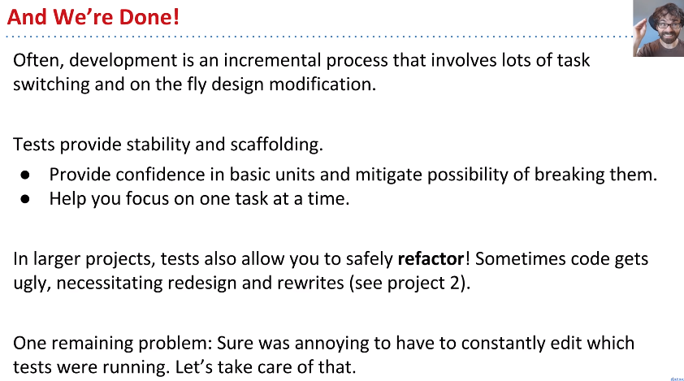

## How Does a Programmer Know That Their Code Works?

We have some that code that runs locally and yell at you if did something wrong.

In the real world, programmer believe their code works because of tests they write themselves.

- Knowing that it works for sure is usually impossible.
- This will be our new way.


## Ad Hoc Testing vs JUnit

The sort method destructively sorts elements inside the original array.

```java
//Ad Hoc
public class TestSort {
    /** Test the Sort.sort method. */
    public static void testSort() {
        String[] input = {"i", "have", "an", "egg."};
        String[] expected = {"an", "egg", "have", "i"};
        Sort.sort(input);

        /**equals operator does not compare contents of the array, 
        * but the addresses of the array.
        *  this is a bug **/
        //if (input != expected) {

        for(int i=0; i<input.length; ++i) {
            if(!input[i].equals(expected[i])){
                System.out.println("Mismatch in position " + i + ", expected: " + expected[i] + ", but got: " + input[i]);
                return;
            }
        }

//        if(!java.util.Arrays.equals(input, expected))
//            System.out.println("Error! There seems to be a problem with Sort.sort.");

    }
    public static void main(String[] args) {
        testSort();
    }
}

```

```java
//Junit
public class TestSort {
    /** Test the Sort.sort method. */
    public static void testSort() {
        String[] input = {"i", "have", "an", "egg."};
        String[] expected = {"an", "egg", "have", "i"};
        Sort.sort(input);

        org.junit.Assert.assertArrayEquals(input, expected);
    }
    public static void main(String[] args) {
        testSort();
    }
}

```


## Selection Sort

Selection sorting a list of N items:

- Find the smallest item.
- Move it to the front.
- Selection sort the remaining N-1 items (without  touching front item)


Why **swap** the selected elements(current Index and the smallest index) instead of **shifting** everything to the right by one and put the smallest number in the empty index.

- swap can be done in O(1) time while shifting everything to the right is O(n) which is expensive

```java
//Selection Sort
```

 

## findSmallest

development driven by testing. We are going to first write a test for findSmallest before we even wirte findSmallest. 

```java
    public static void testFindSmallest() {
        String[] input = {"i", "have", "an", "egg"};
        String expected = "an";

        String actual = Sort.findSmallest(input);
        org.junit.Assert.assertEquals(expected, actual);


        String[] input2 = {"there", "are", "many", "pigs"};
        String expected2 = "are";

        String actual2 = Sort.findSmallest(input2);
        org.junit.Assert.assertEquals(expected2, actual2);
    }

```

```java
   /** Returns the smallest String **/
    public static String findSmallest(String input[]) {
        int smallestIndex = 0;
        for (int i = 0; i < input.length; i++){
            if (input[i].compareTo(input[smallestIndex]) < 0) {
                smallestIndex = i;
            }
        }
        return input[smallestIndex];
    }

```

```java
    public static void testSwap() {
        String[] input = {"i", "have", "an", "egg"};
        int a = 0;
        int b = 2;
        String[] expected = {"an", "have", "i", "egg"};

        Sort.swap(input, a, b);
        org.junit.Assert.assertArrayEquals(input, expected);

    }
```

```java
   /** swaps two indexes of an array */
    public static void swap(String input[], int a, int b) {
        String temp = input[b];
        input[b] = input[a];
        input[a] = temp;
    }

```

When we are putting all this together for our sort method we encounter an api mismatch


```java
public static void sort(String input[]) {
        String smallest = findSmallest(input);
        //swap(smallest); swap only takes int
    }
```

So now we have to rewrite findSmallest to return the smallest index in the passed in array. This is an easy fix.


Testing allow you to focus on a small part of the program at one time instead of juggling all that in your head.




```java
package part03_testing._02JUnit;

/** Tests the Sort class. */
public class Sort {

    /**
     * Find the smallest item
     * Move it to the front
     * Selection sort the remaining N-1 items(without touching front item!).
     */
    public static void sort(String input[]) {
        sort(input, 0);
    }

    private static void  sort (String[] input, int start) {
        if(start == input.length)
            return;

        int smallestIdx = findSmallest(input, start);
        swap(input, start, smallestIdx);
        sort(input, start+1);
    }
    /** Returns the smallest index from a particular starting point
     *  compareTo() method compares the given string with the current string lexicographically
     * lexicographical order is alphabetical order. 1, 10, 2
     * he other type is numerical ordering. Consider the following values,
     *  **/
    public static int findSmallest(String input[], int start) {
        int smallestIndex = start;
        for (int i = start+1; i < input.length; i++){
            if (input[i].compareTo(input[smallestIndex]) < 0) {
                smallestIndex = i;
            }
        }
        return smallestIndex;
    }

    /** swaps two indexes of an array */
    public static void swap(String input[], int a, int b) {
        String temp = input[b];
        input[b] = input[a];
        input[a] = temp;
    }

}

```

```java
package part03_testing._02JUnit;

import java.util.Arrays;

public class TestSort {
    /** Test the Sort.sort method. */
    public static void testSort() {
        String[] input = {"i", "have", "an", "egg"};
        String[] expected = {"an", "egg", "have", "i"};
        Sort.sort(input);

        Arrays.stream(input).forEach(val -> System.out.print(val + " "));
        org.junit.Assert.assertArrayEquals(input, expected);
    }

    /** Test the Sort.findSmallest method. */
    public static void testFindSmallest() {
        String[] input = {"i", "have", "an", "egg"};
        int expected = 2;

        int actual = Sort.findSmallest(input, 0);
        org.junit.Assert.assertEquals(expected, actual);


        String[] input2 = {"there", "are", "many", "pigs"};
        int expected2 = 1;

        int actual2 = Sort.findSmallest(input2, 0);
        org.junit.Assert.assertEquals(expected2, actual2);
    }

    public static void testSwap() {
        String[] input = {"i", "have", "an", "egg"};
        int a = 0;
        int b = 2;
        String[] expected = {"an", "have", "i", "egg"};

        Sort.swap(input, a, b);
        org.junit.Assert.assertArrayEquals(input, expected);

    }


    public static void main(String[] args) {
        testSort();
        testFindSmallest();
        testSwap();
    }
}

```


## Better JUnit

Junit Assert link: https://junit.org/junit4/javadoc/4.12/org/junit/Assert.html


A JUnit is runner is called instead of a main method

```java
package part03_testing._02JUnit;

import org.junit.Test;
import static org.junit.Assert.*;

import java.util.Arrays;

public class TestSort {
    /** Test the Sort.sort method. */
    @Test
    public void testSort() {
        String[] input = {"i", "have", "an", "egg"};
        String[] expected = {"an", "egg", "have", "i"};
        Sort.sort(input);

        Arrays.stream(input).forEach(val -> System.out.print(val + " "));
        assertArrayEquals(input, expected);
    }

    /** Test the Sort.findSmallest method. */
    @Test
    public void testFindSmallest() {
        String[] input = {"i", "have", "an", "egg"};
        int expected = 2;

        int actual = Sort.findSmallest(input, 0);
        assertEquals(expected, actual);


        String[] input2 = {"there", "are", "many", "pigs"};
        int expected2 = 1;

        int actual2 = Sort.findSmallest(input2, 0);
        assertEquals(expected2, actual2);
    }

    @Test
    public void testSwap() {
        String[] input = {"i", "have", "an", "egg"};
        int a = 0;
        int b = 2;
        String[] expected = {"an", "have", "i", "egg"};

        Sort.swap(input, a, b);
        assertArrayEquals(input, expected);

    }

}
```

## Testing Philosophy


##### Correctness Tool #2: JUnit Tests

JUnit testing, as we have seen, unlocks a new world for you. Rather than relying on an autograder written by someone else, you write tests for each piece of your program. We refer to each of these pieces as a unit. This allows you to have confidence in each unit of your code - you can depend on them. This also helps decrease debugging time as you can isolate attention to one unit of code at a time (often a single method). Unit testing also forces you to clarify what each unit of code should be accomplishing.

There are some downsides to unit tests, however. First, writing thorough tests takes time. It's easy to write incomplete unit tests which give a false confidence to your code. It's also difficult to write tests for units that depend on other units (consider the `addFirst` method in your `LinkedListDeque`).

***Test-Driven Development (TDD)\***

TDD is a development process in which we write tests for code before writing the code itself. The steps are as follows:

1. Identify a new feature.
2. Write a unit test for that feature.
3. Run the test. It should fail.
4. Write code that passes the test. Yay!
5. Optional: refactor code to make it faster, cleaner, etc. Except now we have a reference to tests that should pass.

Test-Driven Development is not required in this class and may not be your style but unit testing in general is most definitely a good idea.

##### Correctness Tool #3: Integration Testing

Unit tests are great but we should also make sure these units work properly together ([unlike this meme](https://media.giphy.com/media/3o7rbPDRHIHwbmcOBy/giphy.gif)). Integration testing verifies that components interact properly together. JUnit can in fact be used for this. You can imagine unit testing as the most nitty gritty, with integration testing a level of abstraction above this.

The challenge with integration testing is that it is tedious to do manually yet challenging to automate. And at a high level of abstraction, it's easy to miss subtle or rare errors.

As a summary, you should **definitely write tests but only when they might be useful!** Taking inspiration from TDD, writing your tests before writing code can also be very helpful in some cases.
