# Inheritance, Implements

## 4.1 Intro and interfaces

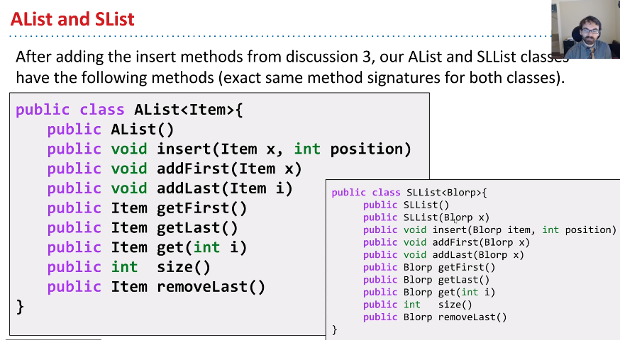

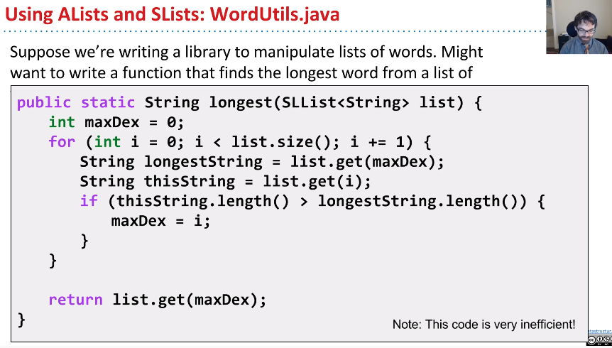


```java
public class WordUtils {
    /** Returns the length of the longest word. */
    public static String longest(SLList<String> list) {
        int maxDex = 0;
        for(int i = 0; i< list.size(); ++i) {
            String longestString = list.get(maxDex);
            String thisString = list.get(i);
            if (thisString.length() > longestString.length()) {
                maxDex = i;
            }
        }
        return list.get(maxDex);
    }

    public static void main(String[] args) {
        AList <String> someList = new AList<>();
        someList.addLast("elk");
        someList.addLast("are");
        someList.addLast("watching");
        System.out.println(longest(someList)); //this is not going to work since longest will only talke SLList
    }
}
```


How do we fix this problem?

- We can make longest take in AList, and it should all work.
- Another solution is to make a copy for each for SLList and AList.

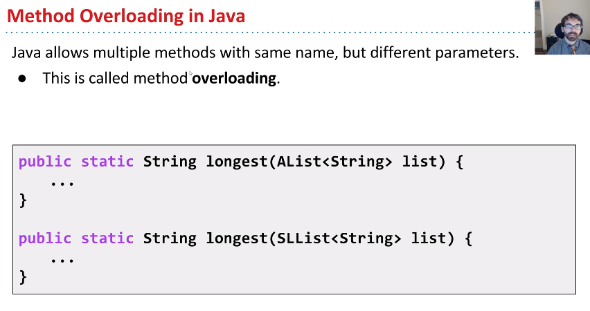


While overloading works,  it is a bad idea in the case of longest. Why?

- Our source code files are unnecessary long?
- Repeating yourself... seems aesthetically gross.
- **More code to maintain.**
  - Any change made to one, must be made to another.
  - Including bug fixes!

- Suppose we make another list someday, we'll need yet another function.

### Hypernyms and Hyponyms

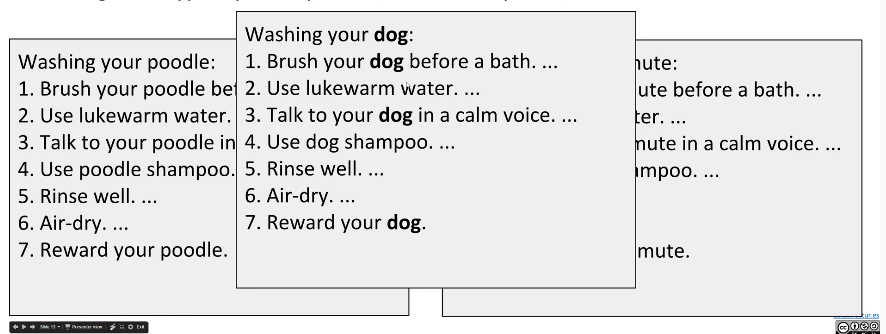

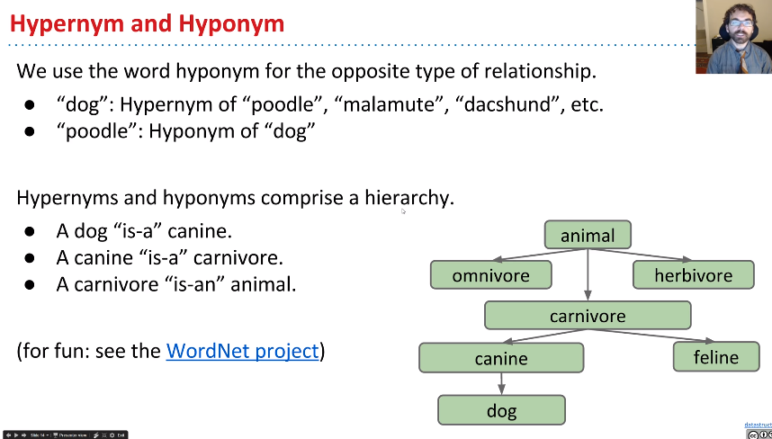

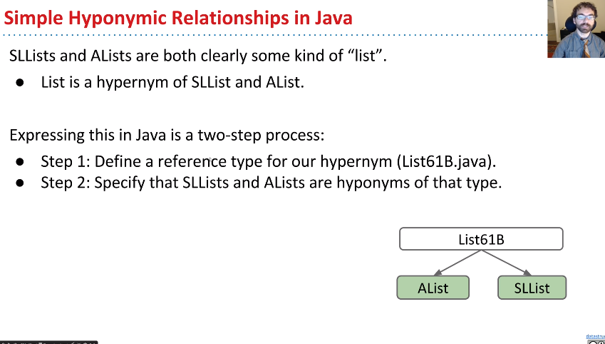

​	

Note: any private functions or variables that need not be in the interface. Those are implementing details anyways.

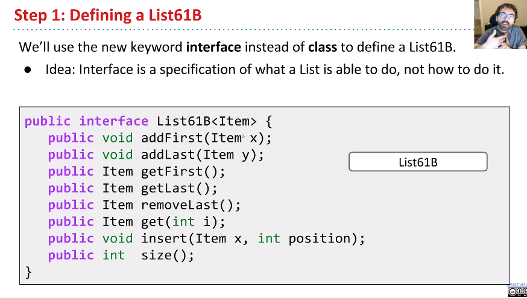

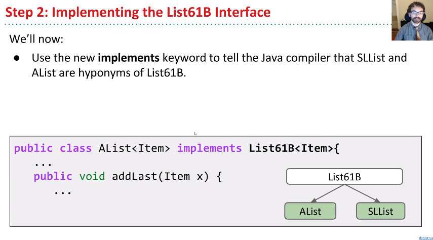

```java
package part04_inheritance;

public interface List61B<Item> {
    public void addFirst(Item x);
    public void addLast (Item x);
    public Item getFirst();
    public Item getLast();
    public Item removeLast();
    public Item get(int i);
    public void insert(Item x, int position);
    public int size();
}

```

```java
public class AList<Item> implements List61B<Item> {

    private Object[] items;
    private int size;


    /** Creates an empty list. */
    public AList() {
        items =  new Object[100];
        size = 0;
    }

    @Override
    public void addFirst(Item x) {

    }

    /** Inserts X into the back of the list. */
    public void addLast(Item x) {
        if(size == items.length)
            resize(size*2);
        items[size] = x;
        ++size;
    }

    @Override
    public Item getFirst() {
        return get(0);
    }

    private void resize(int capacity) {
        Object[] a  = new Object[capacity];
        System.arraycopy(items, 0, a, 0, size);
        items = a;
    }

    /** Returns the item from the back of the list. */
    public Item getLast() {
        return (Item) items[size-1];
    }

    /** Gets the ith item in the list (0 is the front). */
    public Item get(int i) {
        return (Item) items[i];
    }

    @Override

    public void insert(Item x, int position) {
    //    items[position] = x;
        //it has to be inside the size
        //check if occupied
            //if occupied shift to right over 1.
            //make to sure to check if the underlying array can handle that shift.
                //if not resize
    }

    public int size(){
        return size;
    }

    /** Deletes item from back of the list and
     * returns deleted item.
     */
    public Item removeLast() {
        Item x = getLast();
        items[size - 1] = null; //Unused objects need to have no reference.
        --size;
        return x;
    }
}
```

```java
public class WordUtils {
    /** Returns the length of the longest word. */
    public static String longest(List61B<String> list) {
        int maxDex = 0;
        for(int i = 0; i< list.size(); ++i) {
            String longestString = list.get(maxDex);
            String thisString = list.get(i);
            if (thisString.length() > longestString.length()) {
                maxDex = i;
            }
        }
        return list.get(maxDex);
    }

    public static void main(String[] args) {
        AList<String> someList = new AList();
        someList.addLast("elk");
        someList.addLast("are");
        someList.addLast("watching");
        System.out.println(longest(someList));
    }
}
```

### Overriding vs Overloading 

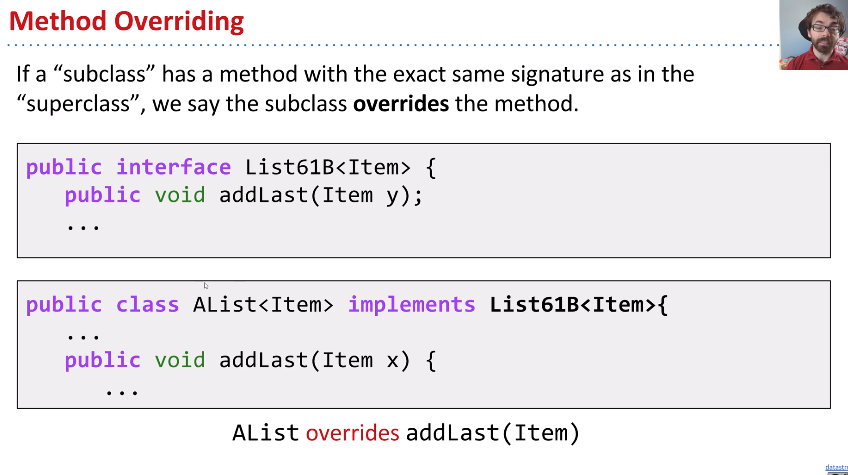

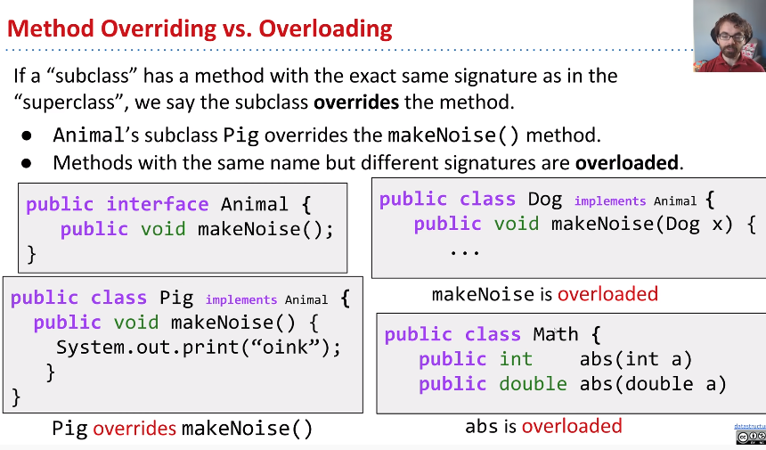

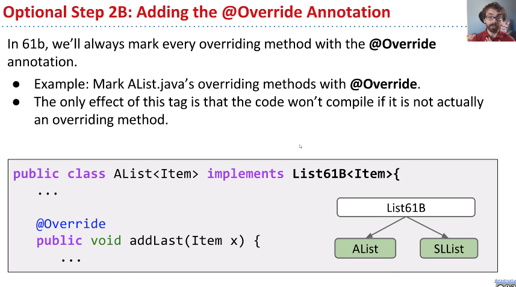

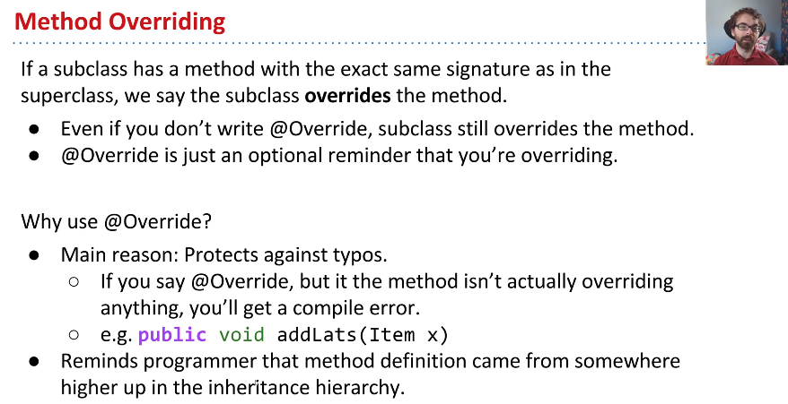

### Interface Inheritance

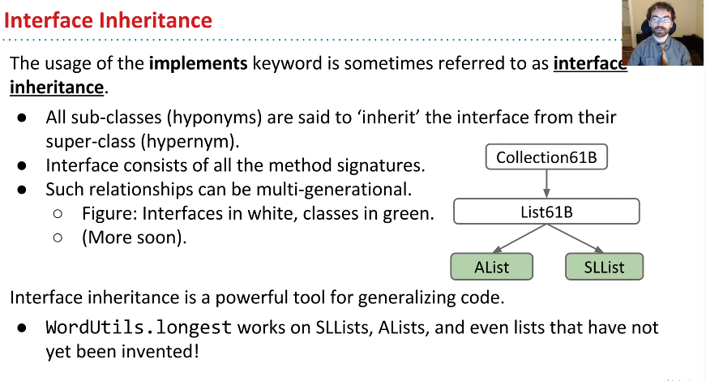

### GROE

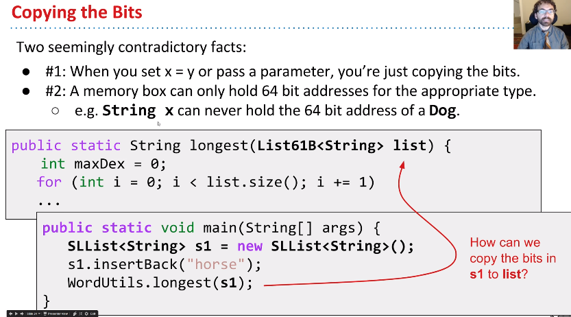

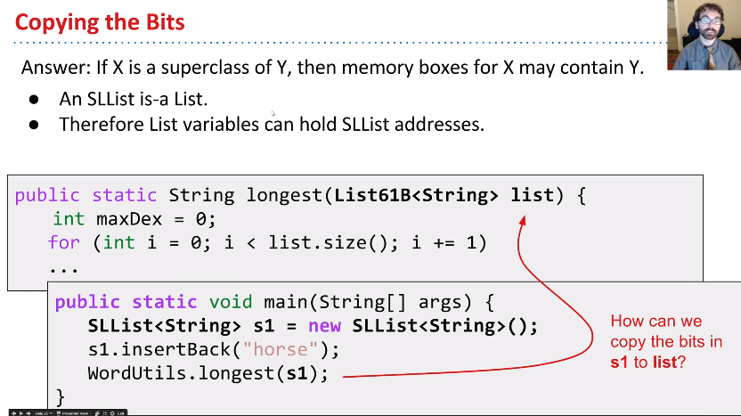

**Exercise 4.1.2** Do you think the code below will compile? If so, what happens when it runs?

```java
public static void main(String[] args) {
    List61B<String> someList = new SLList<String>();
    someList.addFirst("elk");
}
```

Here are possible answers:

- Will not compile.
- Will compile, but will cause an error on the **new** line
- When it runs, an SLList is created and its address is stored in the someList variable, but it crashes on someList.addFirst() since the List class doesn't implement addFirst;
- **When it runs, and SLList is created and its address is stored in the someList variable. Then the string "elk" is inserted into the SLList referred to by addFirst.**

### Implementation Inheritance

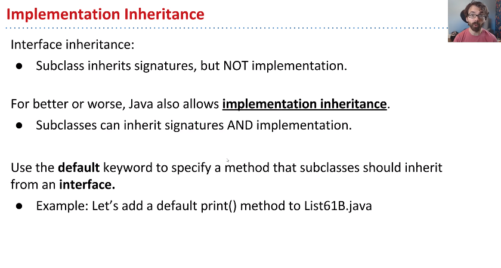

```java
ackage part04_inheritance;

public interface List61B<Item> {
    //interface inheritance, subclass only inherits signatures.
    public void addFirst(Item x);
    public void addLast (Item x);
    public Item getFirst();
    public Item getLast();
    public Item removeLast();
    public Item get(int i);
    public void insert(Item x, int position);
    public int size();

    /** Prints out the entire list. */
    //subclass also inherits implementation.
    default public void print(){
        for (int i = 0; i < size(); ++i) {
            System.out.println(get(i) + " ");
        }
        System.out.println();
    }
}

```

```java
package part04_inheritance;

public class IsaDemo {
    public static void main(String[] args) {
        SLList<String> someList = new SLList<>(); //note someList not a List61B variable.
        someList.addFirst("elk");
        someList.addLast("dwell");
        someList.addLast("on");
        someList.addLast("existential");
        someList.addLast("crises");
        someList.print();
    }
}

```

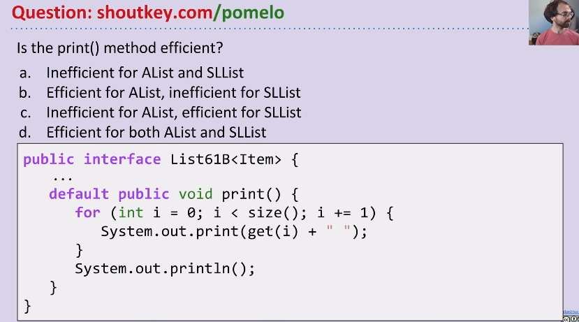

b.  Efficient for AList, inefficient for SLList. get for AList is superfast, SLList has to traverse to every element to get it.

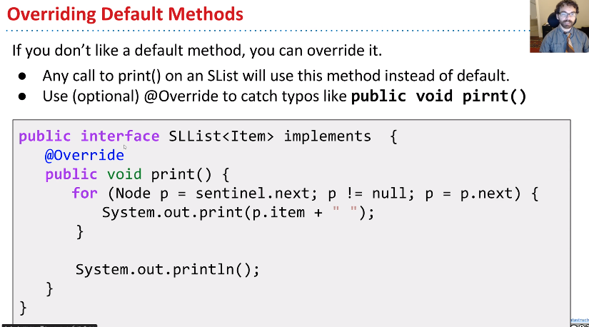

`

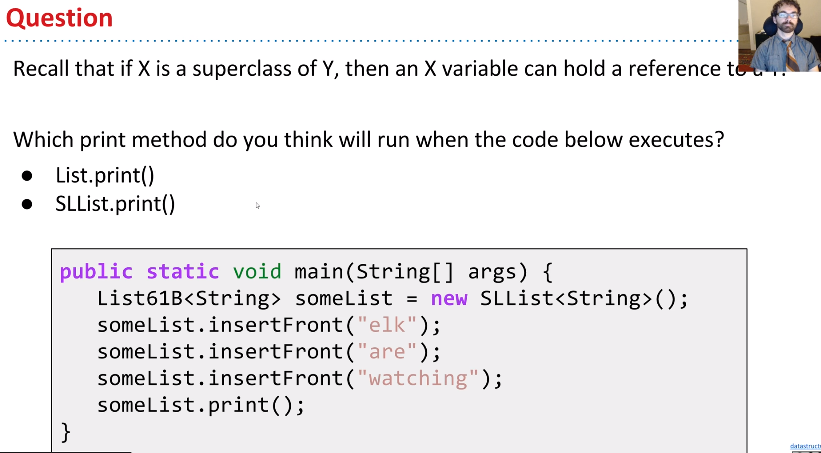

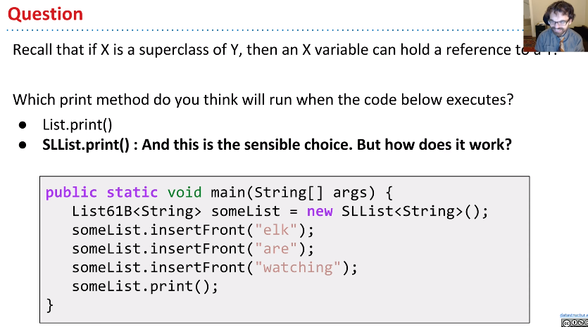

### Dynamic Method Selection

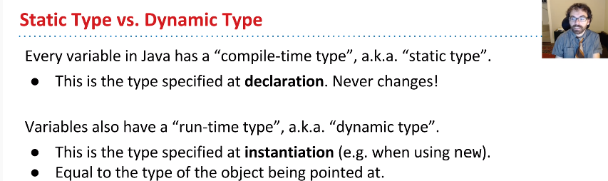

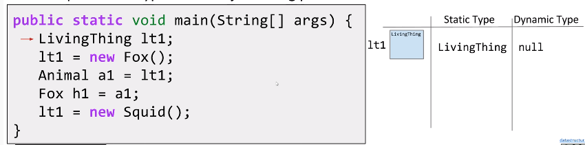

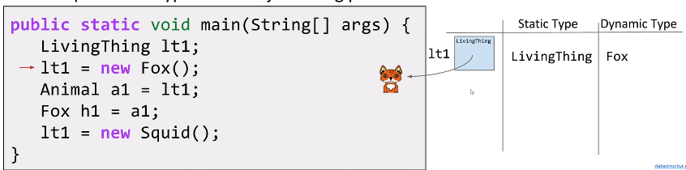

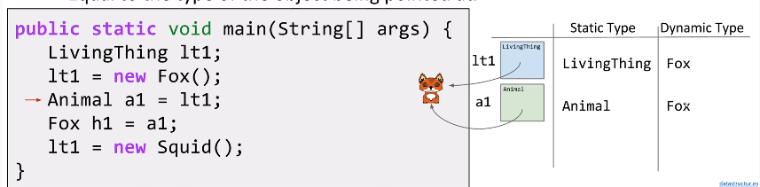

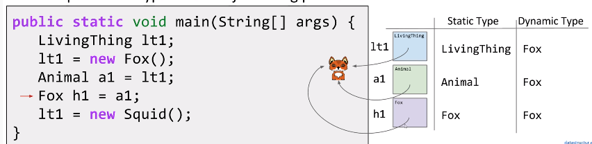

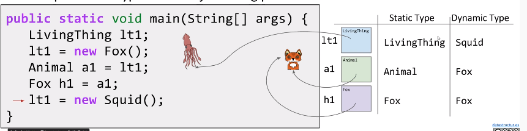

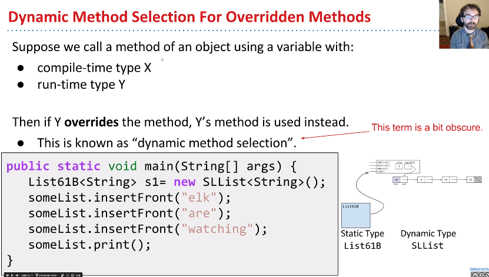


### Overloading Puzzle

Say there are two methods in the same class

```java
public static void peek(List61B<String> list) {
    System.out.println(list.getLast());
}
public static void peek(SLList<String> list) {
    System.out.println(list.getFirst());
}
```

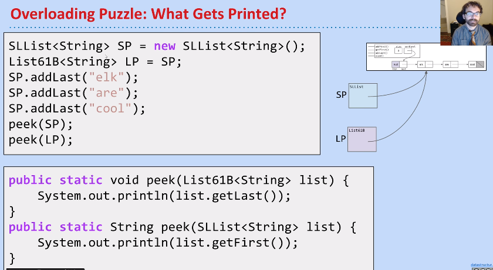

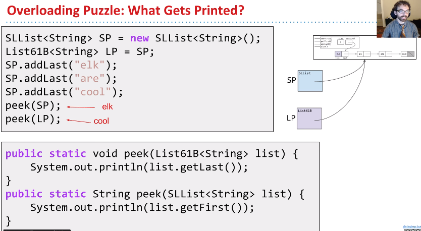

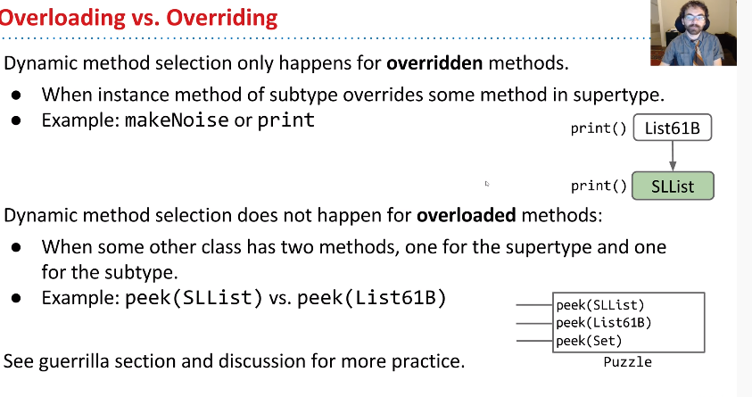


### Summary


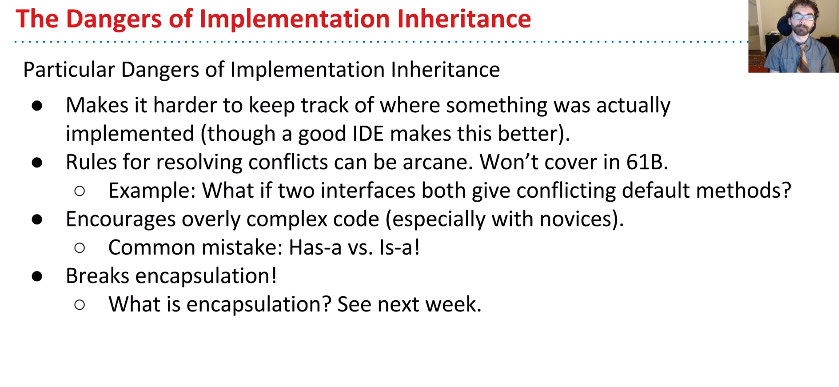

