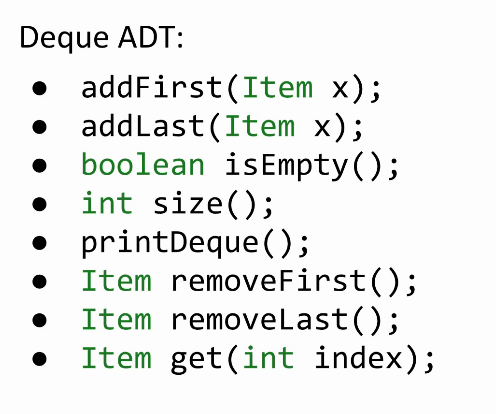

# ADT

**AList** was based on resizing arrays, SLList was made using the linked list. 

An **Abstract Data Type** (ADT) **is defined only by its operations**, not by its implementation.

In this case, we say that ArrayDeque and LinkedListDeque are *implementations* of the Deque ADT.

An implementation is a distinct thing than we have of our data sets.

The Deque ADT can have many implementations.

Some commonly used ADT's are:

- Stacks: Structures that support last-in first-out retrieval of elements

  - `push(int x)`: puts x on the top of the stack
  - `int pop()`: takes the element on the top of the stack

- Lists

  : an ordered set of elements

  - `add(int i)`: adds an element
  - `int get(int i)`: gets element at index i

- Sets

  : an unordered set of unique elements (no repeats)

  - `add(int i)`: adds an element
  - `contains(int i)`: returns a boolean for whether or not the set contains the value

- Maps

  : set of key/value pairs

  - `put(K key, V value)`: puts a key value pair into the map
  - `V get(K key)`: gets the value corresponding to the key

**The bolded ADT's are a subinterfaces of a bigger overarching interface called `Collections`

